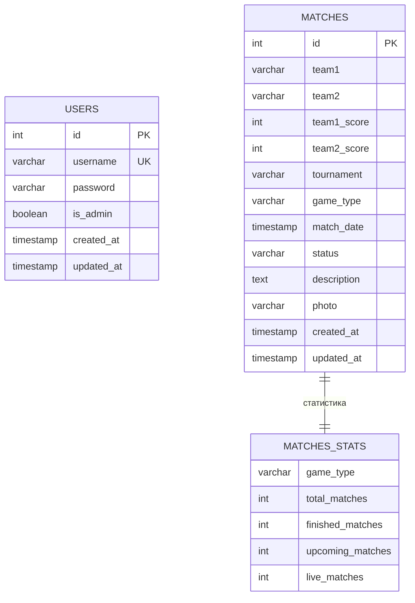

# ER Диаграмма базы данных

## Описание
Диаграмма показывает структуру базы данных киберспортивного сайта с двумя основными таблицами.

## Mermaid ER Diagram

## Описание таблиц

### 1. USERS (Пользователи)
- **id** - Первичный ключ, автоинкремент
- **username** - Уникальное имя пользователя
- **password** - Хешированный пароль
- **is_admin** - Флаг администратора
- **created_at** - Дата создания аккаунта
- **updated_at** - Дата последнего обновления

### 2. MATCHES (Матчи)
- **id** - Первичный ключ, автоинкремент
- **team1, team2** - Названия команд
- **team1_score, team2_score** - Счет команд
- **tournament** - Название турнира
- **game_type** - Тип игры (CS:GO, Dota 2, etc.)
- **match_date** - Дата и время матча
- **status** - Статус (upcoming, live, finished, cancelled)
- **description** - Описание матча
- **photo** - Путь к фотографии
- **created_at, updated_at** - Даты создания и обновления

### 3. MATCHES_STATS (Представление статистики)
- **game_type** - Тип игры
- **total_matches** - Общее количество матчей
- **finished_matches** - Завершенные матчи
- **upcoming_matches** - Предстоящие матчи
- **live_matches** - Текущие матчи

## Индексы

### USERS
- `idx_users_username` - по username
- `idx_users_admin` - по is_admin

### MATCHES
- `idx_matches_status` - по status
- `idx_matches_date` - по match_date
- `idx_matches_game_type` - по game_type
- `idx_matches_tournament` - по tournament
- `idx_matches_teams` - по team1, team2

## Триггеры

Все таблицы имеют триггеры для автоматического обновления поля `updated_at` при изменении записей.

## Права доступа

- **SELECT** - всем пользователям на все таблицы
- **INSERT, UPDATE, DELETE** - на matches для всех
- **INSERT, UPDATE, DELETE** - на users для всех (управление пользователями)
